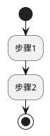
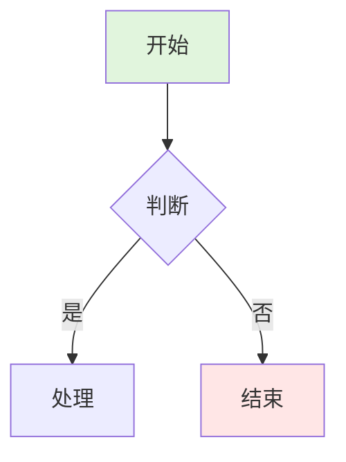
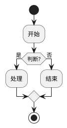
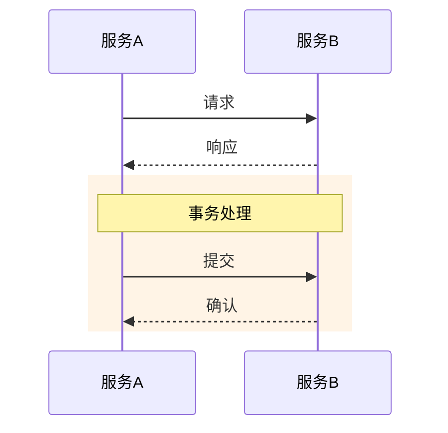
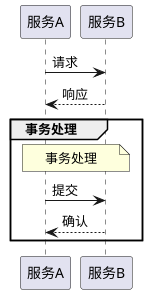
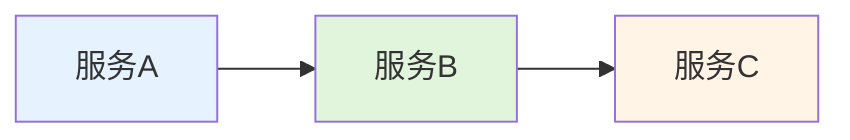
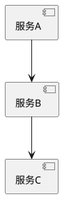
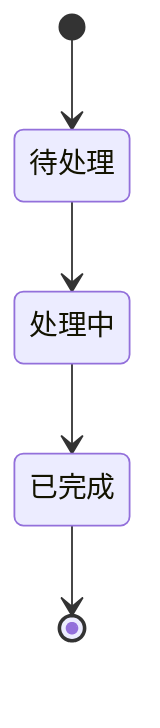

# Mermaid to PlantUML Conversion Skill

## 目标
将 Mermaid 图表转换为兼容性更好的 PlantUML 格式，确保在各种渲染器中都能正常显示。

## 核心原则

### 1. 使用最简洁的语法
- ❌ 避免复杂的样式配置
- ❌ 避免 `skinparam` 中的嵌套配置
- ✅ 优先使用 PlantUML 的默认样式
- ✅ 如果需要样式，使用最基础的 skinparam

### 2. 避免的语法陷阱

#### 活动图 (Activity Diagram)
❌ **避免在 partition 内使用控制流结束**
```plantuml
partition "阶段" {
  if (条件?) then (是)
    :处理;
    stop  ← 会导致语法错误
  endif
}
```

✅ **将控制流移到 partition 外部**
```plantuml
partition "阶段" {
  :处理;
}

if (条件?) then (是)
  :继续;
  stop  ← 正确
endif
```

❌ **避免使用 skinparam activity 样式配置**
```plantuml
skinparam activity {
  BackgroundColor #E3F2FD
  BorderColor #1976D2
}
```

✅ **使用最简洁的语法**


#### 矩形图 (Rectangle Diagram)
❌ **避免使用 rectangle 关键字**
```plantuml
rectangle "服务名\n说明" as A  ← 换行符可能导致错误
```

✅ **使用组件图语法**
```plantuml
[服务名\n说明] as A  ← 兼容性好，支持换行
```

#### 时序图 (Sequence Diagram)
❌ **避免使用 Mermaid 的 rect 背景色**
```mermaid
rect rgb(255, 244, 230)
  A->>B: 消息
end
```

✅ **使用 PlantUML 的 group**
```plantuml
group 描述
  A -> B: 消息
end
```

## 常见图表类型转换规则

### 1. 流程图 (Flowchart / Activity Diagram)

#### Mermaid 语法


#### PlantUML 语法


### 2. 时序图 (Sequence Diagram)

#### Mermaid 语法


#### PlantUML 语法


**关键差异：**
- `->` 实线箭头（Mermaid 中是 `->>`)
- `-->` 虚线箭头（Mermaid 中是 `-->>`)
- 使用 `group` 代替 `rect`

### 3. 组件图 / 架构图

#### Mermaid 语法


#### PlantUML 语法（方式1：组件图）


#### PlantUML 语法（方式2：简单矩形）


### 4. 状态图 (State Diagram)

#### Mermaid 语法

